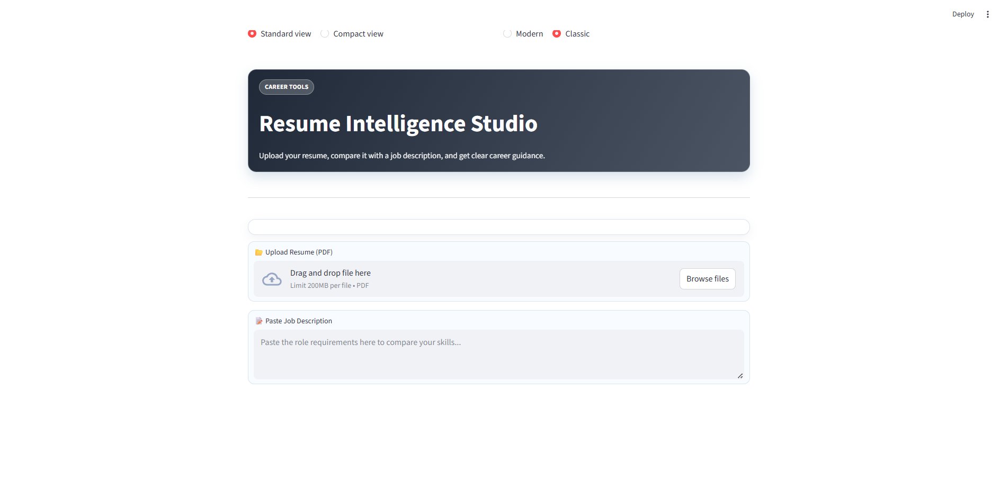
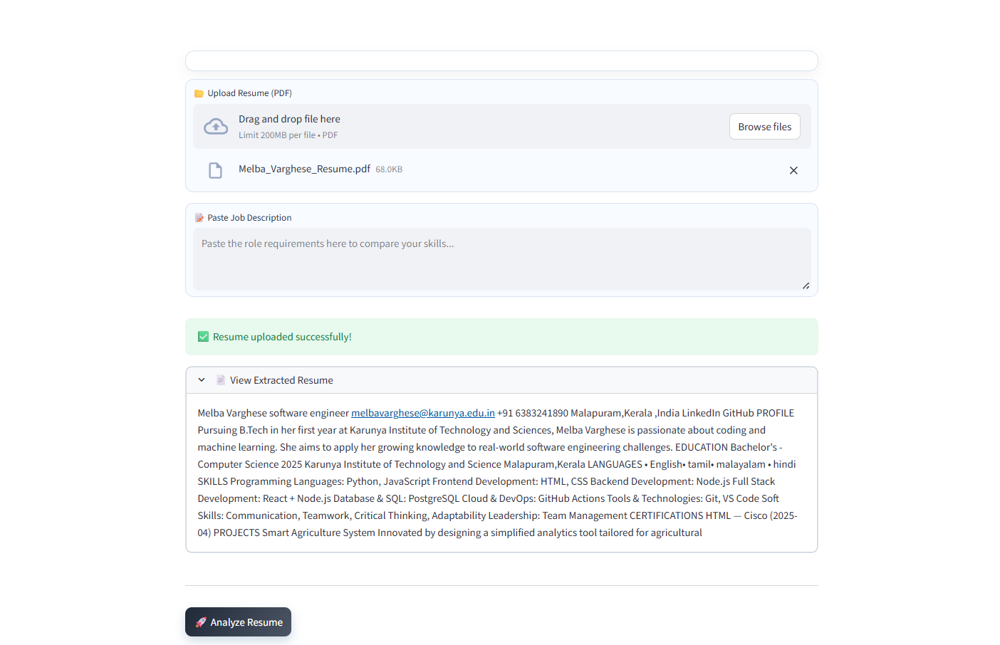

# 🎯 AI Resume Analyzer

An AI-powered web app that analyzes resumes, matches them with job descriptions, and provides actionable insights to improve career readiness.

---

## 🚀 Features

- 📄 Resume Upload (PDF)
- 🧠 Skill Extraction & Scoring (0–10)
- 🎯 Job Description Matching
- ⚠️ Missing Skills Detection
- 📊 Match Percentage with Visual Indicators
- 🧾 Professional PDF Report Generation
- 🎨 Clean & Modern UI (Streamlit)

---

## 🛠 Tech Stack

- Python
- Streamlit
- PyPDF2
- ReportLab

---

## 💡 How it Works

1. Upload your resume
2. Paste a job description
3. Get:
   - Resume score
   - Skills detected
   - Missing skills
   - Suggestions
   - Match percentage

---

## 📸 Screenshots

## 📸 Screenshots

### 🏠 Home Page


### 📤 Upload Section


### 📊 Result Page

---

## ▶️ Run Locally

```bash
pip install -r requirements.txt
streamlit run app.py