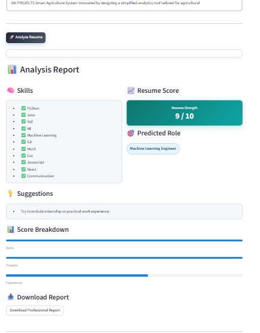

# AI Career Coaching Resume Analyzer

An end-to-end, rule-based resume analysis app built with Python and Streamlit. It helps students and early-career professionals evaluate resume quality, predict best-fit roles, compare resumes, and identify skill gaps against a target job description.

## Why This Project

- Beginner-friendly architecture with clean, modular utilities
- Fast local execution (no model training required)
- Practical outputs: role prediction, weighted score, missing skills, roadmap, and downloadable PDF report

## Key Features

- PDF resume text extraction and normalization
- Config-driven skill extraction (single and multi-word skills)
- Role prediction with confidence percentages
- Job-match scoring with weighted skill importance
- Resume scoring with transparent component breakdown
- Explainable output with reason list and short human-readable insight
- Skill-gap roadmap generation
- Professional PDF report export
- Side-by-side comparison of two resumes
- Beginner and Advanced analysis modes in Streamlit UI

## Tech Stack

- Python 3.10+
- Streamlit
- PyPDF2
- ReportLab

## Screenshots

### Home


### Upload and Analyze


### Results



## Project Structure

```text
ai-career-coaching/
├── app.py
├── assets/
│   └── images/
│       ├── draganddrop.png
│       ├── home.png
│       └── result.png
├── config.py
├── requirements.txt
├── data/
│   ├── roles.json
│   └── skills.json
└── utils/
    ├── __init__.py
  ├── cleaner.py
  ├── insights.py
    ├── matcher.py
    ├── parser.py
    ├── report.py
    ├── role_predictor.py
    ├── scorer.py
  └── skill_extractor.py
```

## Local Setup

### 1. Create and activate a virtual environment

```bash
python -m venv .venv
# Windows PowerShell
.venv\Scripts\Activate.ps1
```

### 2. Install dependencies

```bash
pip install -r requirements.txt
```

### 3. Run the app

```bash
streamlit run app.py
```

## Scoring Formula

```text
score = (
  0.4 * skill_score +
  0.2 * project_score +
  0.2 * experience_score +
  0.1 * resume_quality_score +
  0.1 * keyword_density_score
)
```

## Design Notes

- The solution is intentionally rule-based and interpretable.
- All skill and role mappings are editable in JSON files.
- Repeated operations are cached in Streamlit for responsiveness.

## Future Improvements

- Add automated tests for core scoring and matching utilities
- Add optional NLP embeddings for semantic skill matching
- Add Docker setup for one-command deployment
