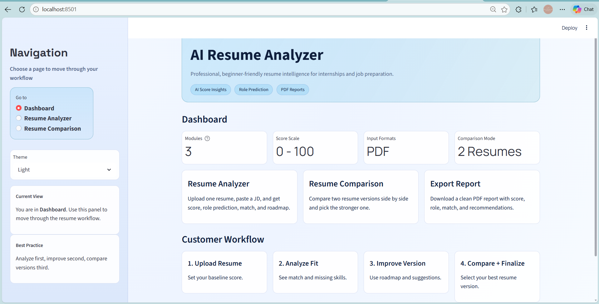
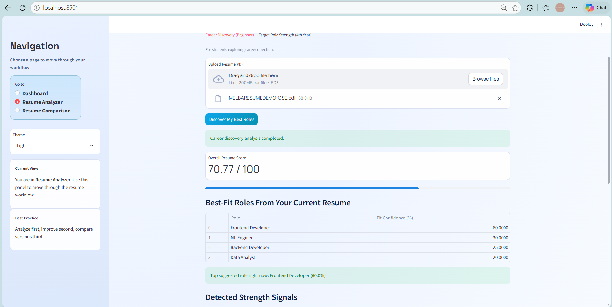
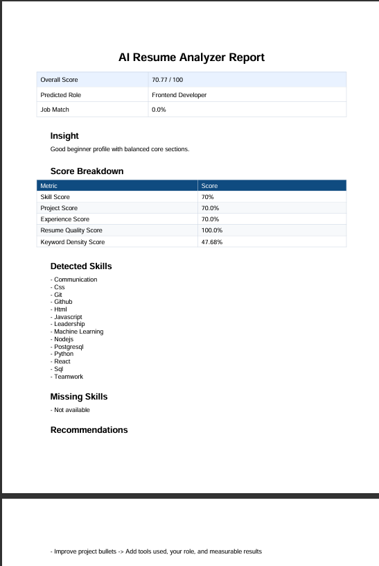
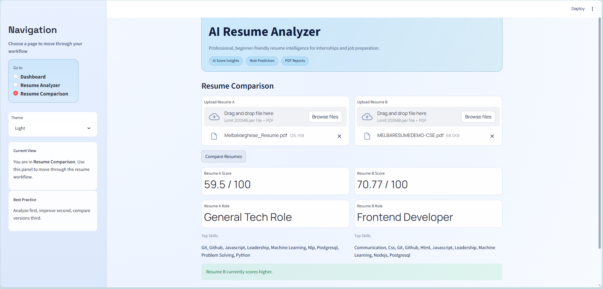

# AI Resume Analyzer

AI Resume Analyzer is a Python and Streamlit app for reviewing resumes, predicting suitable roles, comparing two resumes, and generating practical improvement guidance. It is intentionally rule-based, fast to run locally, and easy to explain in a demo or interview.

## What It Does

- Extracts text from PDF resumes
- Detects relevant technical skills from editable JSON mappings
- Predicts the best-fit role with confidence scores
- Scores resumes with a weighted breakdown
- Matches a resume against an optional job description
- Generates skill-gap roadmaps and PDF reports
- Compares two resumes side by side
- Supports light and dark UI themes in Streamlit

## Tech Stack

- Python 3.10+
- Streamlit
- PyPDF2
- ReportLab

## Screenshots

### Dashboard



### Resume Analyzer



### PDF Report Download



### Resume Comparison



## Project Structure

```text
.
├── app.py
├── config.py
├── requirements.txt
├── assets/
│   └── images/
│       ├── resume_analyzer.png
│       ├── resume_comparison.png
│       ├── resume_dashboard.png
│       └── resume_report_downoaded.png
├── data/
│   ├── roadmap.json
│   ├── roles.json
│   └── skills.json
└── utils/
    ├── __init__.py
    ├── cleaner.py
    ├── insights.py
    ├── matcher.py
    ├── parser.py
    ├── report.py
    ├── role_predictor.py
    ├── scorer.py
    └── skill_extractor.py
```

## Setup

### 1. Create and activate a virtual environment

```bash
python -m venv .venv
.venv\Scripts\Activate.ps1
```

### 2. Install dependencies

```bash
pip install -r requirements.txt
```

### 3. Run the app

```bash
streamlit run app.py
```

## Notes

- The app uses editable JSON files in `data/` for roles, skills, and roadmap guidance.
- The scoring and matching logic is transparent, so results are easy to explain and refine.
- If Windows blocks script execution, run the activation command from an elevated PowerShell session or set the execution policy for the current process.
